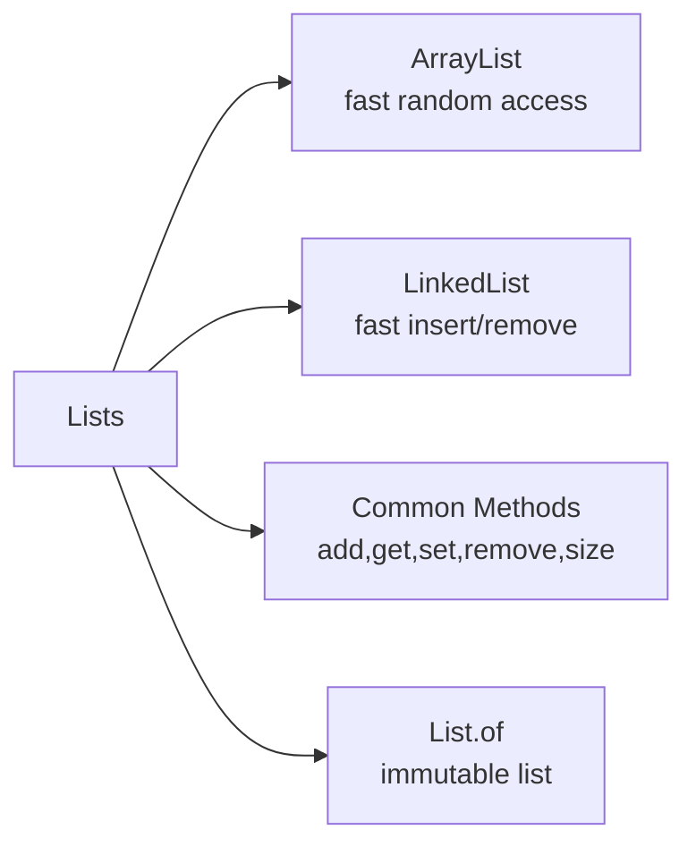

# Day 23: Lists in Java

**Time: ~60 min** (15 read → 35 practice → 10 review)

---

## 🧠 Mind Map



---

## 1. What is a List?

A `List` is an ordered collection that allows duplicate elements. It stores values in a sequence, and every element can be accessed by its index.

### Most common `List` types

- `ArrayList` — best for random access and resizing.
- `LinkedList` — best for frequent insertions and removals in the middle.
- `List.of(...)` — creates a fixed-size, unmodifiable list.

---

## 2. Key List Operations

| Operation | Example | What it does |
|---|---|---|
| `add(value)` | `list.add("apple")` | Adds an element at the end |
| `get(index)` | `list.get(2)` | Reads the element at the given position |
| `set(index, value)` | `list.set(1, "pear")` | Replaces an element |
| `remove(index)` | `list.remove(0)` | Removes by position |
| `remove(value)` | `list.remove("apple")` | Removes the first matching element |
| `size()` | `list.size()` | Returns number of elements |
| `subList(start, end)` | `list.subList(1, 4)` | Returns a view of a range |

---

## 3. List Example

```java
import java.util.ArrayList;
import java.util.List;

public class Day23Example {
    public static void main(String[] args) {
        List<String> colors = new ArrayList<>();
        colors.add("Red");
        colors.add("Blue");
        colors.add("Green");

        System.out.println("Second color: " + colors.get(1));
        colors.set(2, "Yellow");
        colors.remove("Red");

        for (String color : colors) {
            System.out.println(color);
        }
    }
}
```

---

## 4. Why `List.of(...)` is special

- `List.of(...)` creates an unmodifiable list.
- You cannot add, remove, or change elements.
- Useful for fixed data, constants, or test input.

Example:

```java
List<String> fruits = List.of("Apple", "Banana", "Cherry");
// fruits.add("Date"); // throws UnsupportedOperationException
```

---

## 5. Practice Questions

### Easy
1. Create an `ArrayList<String>` and print the third element.
2. Add three names to a list, then remove the second name and print the updated list.
3. Use `List.of(...)` to create a list of 4 colors and explain why the list cannot be modified.

### Medium
4. Write a method `replaceMiddle(List<String> list, String value)` that replaces the middle item with `value`.
5. Given a `List<Integer>`, return the sum of all even numbers using a loop.
6. Sort a `List<String>` alphabetically using `Collections.sort(list)` and print the result.
7. Use `subList(1, 4)` on a list with six elements and describe which elements are included.

### Hard
8. Convert a `List<String>` to an array using `toArray(new String[0])`, then print each array item.
9. Given a `List<Integer>`, remove all duplicate values while preserving insertion order.
10. Create a `LinkedList<String>`, add five items, then remove the first and last elements. Print the final list.

---

## 6. Summary

- Use `ArrayList` for fast indexed access.
- Use `LinkedList` for faster insert/remove operations in the middle.
- `List.of(...)` returns an immutable list.
- Lists keep elements in order and allow duplicates.
3. Write a method `replaceMiddle(List<String> list, String value)` that sets the middle item to `value`.
4. Given a `List<Integer>`, return the sum of all even numbers using a loop.
5. Sort a `List<String>` alphabetically and print the result.  
6. Use `subList(1, 4)` on a list of 6 elements and explain what elements are included.
7. Convert a `List<String>` to an array with `toArray(new String[0])` and print the array elements.
8. Create a `List<String>` using `List.of(...)` and explain why it is unmodifiable.
