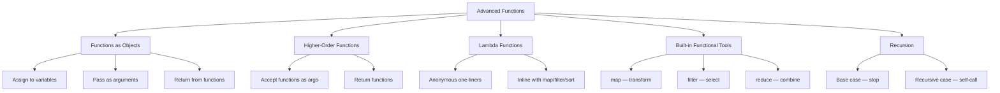

# Day 19: Advanced Functions

> **Core Idea:** In Python, functions are **first-class citizens** — you can pass them around like any other value (integers, strings, etc.). This unlocks powerful patterns like higher-order functions, lambdas, functional built-ins, and recursion.

---

## 🧠 Concept Map



---

## 1. Functions as Objects

In Python, **everything is an object** — including functions. This means you can:

- Assign a function to a variable
- Pass a function as an argument to another function
- Return a function from another function
- Store functions in data structures (lists, dicts, etc.)

```python
def shout(text):
    return text.upper()

# ✅ Assign function to a variable (no parentheses!)
yell = shout
print(yell("hello"))  # HELLO — yell IS shout

# ✅ Pass function as argument
def apply(func, value):
    return func(value)

print(apply(shout, "hi"))  # HI

# ✅ Store functions in a list
operations = [str.upper, str.lower, str.title] # Here str.upper, str.lower, str.title are built-in methods of the 'str' class, they are already functions
for op in operations:
    print(op("hello"))
# HELLO
# hello
# Hello
```

> **Key takeaway:** `shout` = the function object itself. `shout()` = calling the function.

---

## 2. Higher-Order Functions

A **higher-order function** either:
1. **Takes** one or more functions as arguments, **or**
2. **Returns** a function as its result

Yesterday's `make_counter()` was already a higher-order function — it returned a closure!

```python
def greet(name):
    return f"Hello {name}"

def run_twice(func, arg):
    return func(arg), func(arg)

print(run_twice(greet, "Alice"))  # ('Hello Alice', 'Hello Alice')
```

`run_twice` doesn't care what `func` does — it just calls it. This is the **power**: swap behavior without changing the code.

```python
# Same function, different behavior!
print(run_twice(str.upper, "hello"))   # ('HELLO', 'HELLO')
print(run_twice(len, "hello"))         # (5, 5)
```

---

## 3. Lambda Functions

**Lambdas** are anonymous (nameless) functions — single-expression, inline functions defined with the `lambda` keyword.

### `def` vs `lambda`

| Feature | `def` | `lambda` |
|---------|-------|----------|
| Name | Required (function name) | Anonymous (no name) |
| Body | Multiple statements | One expression only |
| `return` | Explicit keyword | Implicit (no `return` keyword) |
| Best for | Reusable, complex logic | Quick, throwaway operations |

### Syntax

```python
# lambda arguments: expression

square = lambda x: x ** 2
print(square(5))  # 25

# Equivalent to:
def square(x):
    return x ** 2
```

### When Lambdas Shine

Lambdas are most useful **inline** — where you need a quick function but don't want to define a full `def`:

```python
# Sort by second element (the letter)
pairs = [(1, "b"), (2, "a"), (3, "c")]
# pairs.sort(...) calls the list method sort on the list named pairs.
# key= tells what value to use when deciding the order and sorts ba a chosen field
# key=lambda pair: pair[1] uses the tuple's second element for sorting.
#   lambda pair: pair[1] takes one argument named pair (each tuple)
#   and returns pair[1], the second item in the tuple.
# So the list is sorted by the letter in each tuple.
pairs.sort(key=lambda pair: pair[1])
print(pairs)  # [(2, 'a'), (1, 'b'), (3, 'c')]

# Multiple parameters
add = lambda a, b: a + b
print(add(3, 4))  # 7

# With conditions
is_even = lambda x: x % 2 == 0
print(is_even(4))  # True
```

> **Rule of thumb:** If your lambda is longer than one line or you need to use it more than once, write a regular `def` instead.

---

## 4. Built-in Higher-Order Functions: `map`, `filter`, `reduce`

These three replace common `for`-loop patterns with cleaner, functional-style code.

### `map` — Transform Every Element

Applies a function to **every** item in an iterable.

```python
nums = [1, 2, 3, 4]

# Without map (old way):
squared = []
for n in nums:
    squared.append(n ** 2)

# With map (Pythonic way):
squared = list(map(lambda x: x ** 2, nums))
print(squared)  # [1, 4, 9, 16]

# map returns an iterator — wrap in list() to see results
```

**Visual:**
```
map(func, [1, 2, 3, 4])
  → func(1), func(2), func(3), func(4)
  → [1, 4, 9, 16]
```

---

### `filter` — Keep Elements Where Condition Is True

Keeps only items where the function returns `True`.

```python
nums = [1, 2, 3, 4, 5, 6]

# Without filter (old way):
evens = []
for n in nums:
    if n % 2 == 0:
        evens.append(n)

# With filter (Pythonic way):
evens = list(filter(lambda x: x % 2 == 0, nums))
print(evens)  # [2, 4, 6]
```

**Visual:**
```
filter(lambda x: x % 2 == 0, [1, 2, 3, 4, 5, 6])
  → keep 2 (True), keep 4 (True), keep 6 (True)
  → drop 1, 3, 5 (False)
  → [2, 4, 6]
```

---

### `reduce` — Boil Down to a Single Value

Combines all elements into one result by repeatedly applying a function.

```python
from functools import reduce  # must import! (not built-in like map/filter)

nums = [1, 2, 3, 4]

total = reduce(lambda a, b: a + b, nums)
print(total)  # 10
```

**Step-by-step:**
```
reduce(lambda a, b: a + b, [1, 2, 3, 4])

Step 1: a=1, b=2 → 3
Step 2: a=3, b=3 → 6
Step 3: a=6, b=4 → 10
Result: 10
```

**Visual:**
```
     +
    / \
   +   4
  / \
 +   3
/ \
1  2

((((1+2)+3)+4)) = 10
```

---

## 5. Recursion

**Recursion** is when a function calls **itself**. It's powerful for problems that break into smaller identical subproblems.

### Two Required Parts

| Part | Purpose | What happens if missing? |
|------|---------|-------------------------|
| **Base case** | Stop condition | Infinite recursion → `RecursionError` |
| **Recursive case** | Call with smaller input | Never reaches the base case |

### Example: Factorial

```python
def factorial(n):
    if n <= 1:                    # base case
        return 1
    return n * factorial(n - 1)   # recursive case

print(factorial(5))  # 120
```

---

### Example: Fibonacci

```python
def fibonacci(n):
    if n <= 1:                    # base case: F(0)=0, F(1)=1
        return n
    return fibonacci(n-1) + fibonacci(n-2)  # recursive case

print(fibonacci(6))  # 8
# Sequence: 0, 1, 1, 2, 3, 5, 8
```

**Full Visual: `fibonacci(4)` — Both Phases**

```
UNWINDING PHASE (going down)          WINDING BACK PHASE (coming up)
─────────────────────────────          ─────────────────────────────

fib(4) = fib(3) + fib(2)              fib(4) = fib(3) + fib(2)
       = ???      + ???                       = 2      + 1 = 3 ✓

      /          \
     /            \
fib(3)          fib(2)              fib(3) = fib(2) + fib(1)
   /    \            1                    = 1      + 1 = 2 ✓
   /      \
fib(2)    fib(1)              fib(2) = fib(1) + fib(0)
   /    \         1                    = 1      + 0 = 1 ✓
   /      \
fib(1)  fib(0)
  1       0        ← BASE CASES HIT!
             ↑
       STOP UNWINDING, START WINDING BACK
```

**Step-by-step trace:**

| Step | Call | Action | Value |
|------|------|--------|-------|
| 1 | `fib(4)` | Unwind: need `fib(3)` and `fib(2)` | ??? |
| 2 | `fib(3)` | Unwind: need `fib(2)` and `fib(1)` | ??? |
| 3 | `fib(2)` | Unwind: need `fib(1)` and `fib(0)` | ??? |
| 4 | `fib(1)` | **Base case!** | **1** |
| 5 | `fib(0)` | **Base case!** | **0** |
| 6 | `fib(2)` | Wind back: `1 + 0` | **1** |
| 7 | `fib(1)` | **Base case!** (already known) | **1** |
| 8 | `fib(3)` | Wind back: `1 + 1` | **2** |
| 9 | `fib(2)` | Already computed | **1** |
| 10 | `fib(4)` | Wind back: `2 + 1` | **3** |

**Stack visualization:**

```
UNWINDING (stack grows)          WINDING BACK (stack shrinks)

┌──────────────────┐             ┌──────────────────┐
│ fib(4) waiting   │             │ fib(4) = 2 + 1 = 3│ ← done
├──────────────────┤             ├──────────────────┤
│ fib(3) waiting   │             │ fib(3) = 1 + 1 = 2│ ← done
├──────────────────┤             ├──────────────────┤
│ fib(2) waiting   │             │ fib(2) = 1 + 0 = 1│ ← done
├──────────────────┤             ├──────────────────┤
│ fib(1) = 1 ✓     │             │ fib(1) = 1 ✓      │ ← done
├──────────────────┤             ├──────────────────┤
│ fib(0) = 0 ✓     │             │ fib(0) = 0 ✓      │ ← done
└──────────────────┘             └──────────────────┘
   ↑ Base cases hit!                  ↑ Stack empties
```

---

### Iteration vs Recursion

| Aspect | Iteration (loops) | Recursion |
|--------|------------------|-----------|
| Style | Explicit loop (`for`/`while`) | Function calls itself |
| State | Variables mutate | Parameters change each call |
| Risk | Infinite loop | Stack overflow (`RecursionError`) |
| Readability | Clear for simple repetition | Elegant for divide & conquer |
| Memory | Low (one loop) | Higher (each call adds a stack frame) |
| Best for | General-purpose | Tree structures, divide & conquer, backtracking |

> **Rule of thumb:** Use loops for simple repetition. Use recursion when the problem naturally breaks into smaller versions of itself (trees, divide & conquer, backtracking).

---

## 📝 Assignments

### Easy

1. **Lambda basics:** Write a lambda that returns the cube of a number. Use it with `map` to cube `[1, 2, 3, 4, 5]`.

2. **Filter evens:** Use `filter` and a lambda to get only even numbers from `[10, 15, 20, 25, 30]`.

3. **Reduce to product:** Use `reduce` to find the product of `[1, 2, 3, 4, 5]`.

4. **Function as object:** Assign `str.upper` to a variable called `to_upper`, then call it with `"hello"`.

### Medium

5. **Sort by last letter:** Given `["apple", "banana", "cherry", "date"]`, sort them by their **last** character using a lambda key.

6. **Celsius to Fahrenheit:** Use `map` and a lambda to convert `[0, 10, 20, 30, 40]` Celsius to Fahrenheit (`C * 9/5 + 32`).

7. **Recursive sum:** Write a recursive function `sum_to(n)` that returns the sum of 1 to n (no loops allowed).

8. **Custom higher-order:** Write a function `repeat(n, func, value)` that calls `func` on `value`, `n` times. Example: `repeat(3, lambda x: x * 2, 1)` should return `8` (double 1 → 2 → 4 → 8).

9. **Filter words by length:** Use `filter` and a lambda to keep only words longer than 4 characters from `["hi", "hello", "hey", "world", "go"]`.

### Hard

10. **Recursive palindrome checker:** Write `is_palindrome(s)` that returns `True` if `s` reads the same forwards and backwards, using recursion (no loops, no `s[::-1]`).
    - **Hint:** Compare first and last characters. If they match, recurse on the middle substring.

11. **Pipeline:** Write a function `pipeline(*funcs)` that takes any number of functions and returns a new function that chains them.
    ```python
    add_one = lambda x: x + 1
    double  = lambda x: x * 2
    square  = lambda x: x ** 2

    f = pipeline(add_one, double, square)
    print(f(3))  # ((3+1)*2)^2 = 64
    ```

12. **Recursive list reversal:** Write `reverse_list(lst)` that returns a reversed copy of a list using recursion (no `lst[::-1]` or `list.reverse()`).
    - **Hint:** Base case: empty list or single element. Recursive case: last element + reverse of the rest.

13. **My reduce:** The `reduce` function accepts a third argument `initial`. Without using `reduce`, write your own `my_reduce(func, iterable, initial=None)` that works like the real one.
    ```python
    def my_reduce(func, iterable, initial=None):
        # Your implementation here
        pass

    print(my_reduce(lambda a, b: a + b, [1, 2, 3, 4]))          # 10
    print(my_reduce(lambda a, b: a + b, [1, 2, 3, 4], 10))      # 20
    ```
